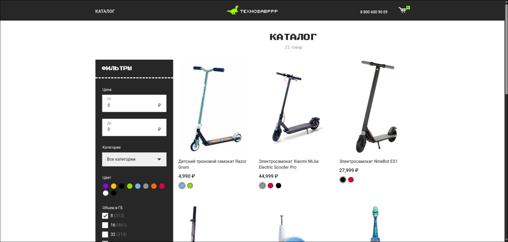

# skillbox_store

Интернет-магазин электроники, разработанный на Vue.js. Приложение включает каталог товаров с фильтрацией, корзину покупок и систему оформления заказов.



## Основные возможности

- Просмотр каталога товаров с фильтрацией по категориям и цене
- Детальная информация о товарах
- Корзина покупок с возможностью изменения количества товаров
- Оформление заказа с заполнением данных покупателя
- Адаптивный дизайн для различных устройств

## Технологии

- Vue.js 2.7
- Vuex 3 для управления состоянием
- Vue Router 3 для навигации
- Axios для API запросов

## Project setup
```
npm install
```

### Compiles and hot-reloads for development
```
npm run serve
```

### Compiles and minifies for production
```
npm run build
```

### Lints and fixes files
```
npm run lint
```

### Customize configuration
See [Configuration Reference](https://cli.vuejs.org/config/).
